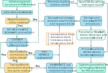

# pep2mars publication code



This repository contains the workflow code used to prepare Amber-compatible simulation inputs for peptide systems that include noncanonical amino acids, covalent peptide modifications, or peptide-like ligands. The code was assembled for the accompanying publication and is optimized for the author's HPC environment rather than as a general-purpose packaged software release.

At a high level, the pipeline:

1. reads an input peptide or peptide-complex PDB,
2. identifies nonstandard residues and covalently linked blocks,
3. builds capped fragments (blocks) for charge fitting,
4. estimates formal charges for those fragments/blocks,
5. runs RESP partial-charge fitting,
6. generates Amber library/parameter files for the fragments/blocks, and
7. rebuilds the full solvated Amber system (`prmtop`, `inpcrd`, `pdb`).

The main output is a solvated Amber-ready system that can be taken into downstream minimization, equilibration, or production MD workflows.

## What is in this repository

The repository is organized around a small number of driver scripts plus helper modules:

- `0_pep2mars.sh`: top-level Slurm submission wrapper for the full workflow.
- `1_build_system.py`: main driver for block preparation, charge-fitting job submission, Amber library generation, and final `tleap` assembly.
- `2_prepare_pep_caps.py`: identifies nonstandard residues / ligands, splits the system into capped blocks, guesses block formal charges, and writes intermediate visualization and bookkeeping files.
- `3_PPmd_gp4.sh`: submits per-block optimization and RESP charge-fitting jobs.
- `4_fit_pep_chgs.py`: converts fitted fragment charges into Amber residue libraries (`.lib`) or ligand prep files (`.prep`) plus `frcmod` parameter files.
- `resp_calc/`: RESP/ESP helper scripts, including `atomic_charge_fitting.py` and auxiliary scripts.
- `utils/`: internal helpers for block classification and RDKit-based geometry cleanup.
- `examples/`: examples of prepared systems and outputs.
- `test/`: running directory of an example, will be uploaded later.

## Workflow overview

### Stage 1: submit the workflow

`0_pep2mars.sh` is the intended entry point. It validates arguments, creates a working directory, writes a Slurm submission script, and launches `1_build_system.py`.

### Stage 2: detect covalent blocks and prepare capped fragments

`1_build_system.py` first calls `2_prepare_pep_caps.py` on the input PDB. That script:

- separates nonprotein residues and noncanonical amino acids,
- reconstructs connectivity with MDAnalysis and PyMOL,
- groups linked residues into single/pair/triple/quartet blocks,
- caps exposed peptide termini with ACE/NME,
- writes per-block PDB/SDF files, and
- guesses each block's formal charge, saving the result in `blocks_charges.json`.

Important intermediate files from this stage commonly include:

- `blocks_charges.json`
- `full_st_connected.pdb`
- `full_st_nh_leap.pdb`
- `full_st_nh_leap_ter.pdb`
- `capping_results.pse`
- `pure_lig_*.pdb` / `pure_lig_*.sdf`
- `capped_*_unit*.pdb` / `capped_*_unit*.sdf`

### Stage 3: optimize each fragment and fit charges

For each fragment, `1_build_system.py` launches `3_PPmd_gp4.sh`, which:

- performs an RDKit/MM cleanup through `utils/mm_opt.py`,
- submits a RESP fitting job through `resp_calc/atomic_charge_fitting.py`,
- runs Gaussian or Psi4 ESP generation as needed, and
- collects per-fragment charge-fitting outputs.

`RESP` is the default and best-supported route in the current code. `BCC` exists, but it is less reliable and experimental.

### Stage 4: build Amber residue and ligand parameter files

After ESP/RESP fitting, `4_fit_pep_chgs.py`:

- freezes ACE/NME cap charges, which is always a zero sum.
- redistributes fitted charges back onto the real residue atoms,
- writes `.chg` files,
- creates Amber residue libraries (`RES_*.lib`) for amino-acid-like blocks,
- creates ligand prep files (`LIG_*.prep`) for ligand-like blocks, and
- writes a mapped force field parameter file `frcmod` by parmchk2.

### Stage 5: rebuild the full solvated Amber system

Finally, `1_build_system.py` uses `pdb4amber` (optional), `tleap`, and `cyclic_tleap.sh` to:

- rebuild the complex from the original peptide plus fitted fragment parameters,
- restore cyclic-backbone connectivity when necessary,
- solvate the complex, and
- optionally add salt.

Typical final outputs are:

- `cpx_solvated.prmtop`
- `cpx_solvated.inpcrd`
- `cpx_solvated.pdb`
- `cpx_vac.pdb`
- `leap.log`

## Included examples
The example folders are archived workflow outputs rather than a one-click demo harness. They are best used as reference data for expected file naming, directory layout, and end products.

## Software requirements

This code is cluster-oriented and assumes a Linux environment with Slurm and environment modules.

### Python environments provided here

Two Conda environment files are included:

- `fldev.requirement.yml`
- `p4dev.requirement.yml`

From those files and the imports in the code, the main Python-level dependencies are:

- Python 3.8+
- RDKit 2024.3 or above
- MDAnalysis
- pymol-open-source
- Psi4, 1.91 or above
- `resp`
- NumPy
- pandas
- SciPy
- scikit-learn
- Biopython

`2_prepare_pep_caps.py` imports `Bio.PDB`, but Biopython is not listed in the provided environment YAML.

### External non-Python tools assumed by the scripts

The workflow also expects the following tools to be installed and callable:

- Slurm (`sbatch`, `squeue`)
- Lmod / Environment Modules
- AmberTools / Amber
  - `pdb4amber`
  - `tleap`
  - `antechamber`
  - `prepgen`
  - `parmchk2`
  - `resp`
  - `espgen`
- Gaussian 16
- Psi4
- standard Unix command-line tools (`bash`, `grep`, `sed`, `awk`, `find`, `cp`)

## Environment setup

If you want to reproduce the original runtime layout as closely as possible, create both Conda environments:

```bash
conda env create -f fldev.requirement.yml
conda env create -f p4dev.requirement.yml
```

After that, review the hard-coded paths and module names in the scripts before running anything on a new machine. In particular, the code contains environment-specific assumptions such as:

- absolute Python interpreter paths in script shebangs,
- absolute module-init paths,
- hard-coded module names such as `amber/a22t23` and `gaussian/16.c02`,
- cluster partition names such as `CPU_5318Y_96C`,
- site-specific scratch locations,
- direct calls to `/public/home/...` resources.

## How to run

### Recommended entry point

Run the full workflow through `0_pep2mars.sh`.

Example:

```bash
bash 0_pep2mars.sh \
  -w /path/to/run_dir \
  -p /absolute/path/to/input.pdb \
  -j example_job \
  -t 24 \
  -f amber_ff14SB \
  -T 310 \
  -b TIP3P \
  -c resp \
  -s 0.15
```

Arguments:

- `-w, -workDir`: working directory for all intermediate and output files
- `-p, -pdbName`: input PDB file
- `-j, -jobName`: Slurm job name
- `-t, -jobTime`: requested runtime in hours
- `-f, -forceField`: force-field selector used by the wrapper
- `-T, -temper`: temperature value passed through the wrapper
- `-b, -waterBox`: water model keyword
- `-c, -chargeType`: charge model, typically `resp`
- `-s, -saltConc`: salt concentration in mol/L


## Important outputs and intermediates

During a typical run you should expect a mix of (in test dir):

- block PDB/SDF files for individual capped fragments,
- charge-guess files such as `blocks_charges.json`,
- per-fragment RESP working directories,
- optimized geometries (`*_opt.pdb`, `*.xyz`, `*.esp`),
- Amber residue libraries (`*.lib`),
- Amber prep files (`*.prep`, `*.prepc`),
- block parameter files (`*.frcmod`),
- final solvated complex files (`cpx_solvated.*`),
- PyMOL session files for inspection (`*.pse`).

## Portability

This repository is publication code, not a polished portable package. Because it's recommend to use the workflow the published webserver (See the cited paper in the end for URL). If you plan to reuse it outside the original cluster, expect to adjust at least some of the following:

- shebangs that point to the author's personal Conda environments,
- module-init paths and module names,
- Slurm partition and memory settings,
- absolute helper-script paths,
- local expectations about Amber installation layout,
- Gaussian and Psi4 availability,
- path conventions for helper scripts and generated files.

There are also a few implementation details where the safest approach is to follow the code rather than the comments. For example:

- use `TIP3P`-style water model names rather than `TIP3PBOX`, because the `tleap` writer appends `BOX` internally;
- treat `RESP` as the supported production route;
- verify path assumptions inside the Python and shell wrappers before launching large jobs.

### Practical notes for running

- Use an absolute path for the input PDB, or place the PDB inside the working directory before submission.
- `RESP` is the intended default charge method.
- The code expects Slurm and launches nested jobs for fragment charge fitting.
- The workflow is designed for prepared peptide structures with reasonable bonding/connectivity information.
- When bugs occurred for formal charge calculation from mm or qm levels, one the provide the `blocks_charges.json` manually according to the capping results.

## Commercial software note

This workflow depends on Gaussian (optional choice) and Amber/AmberTools. Gaussian is commercial software, and Amber (gpu part) is also commercial software. Please ensure that you have access to the required licensed software before attempting to run the full pipeline.

## Citation

To be added when the paper published